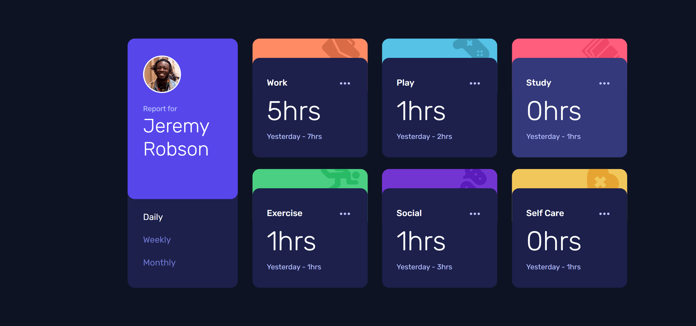

# Frontend Mentor - Time tracking dashboard solution

This is a solution to the [Time tracking dashboard challenge on Frontend Mentor](https://www.frontendmentor.io/challenges/time-tracking-dashboard-UIQ7167Jw). Frontend Mentor challenges help you improve your coding skills by building realistic projects. 

## Table of contents

- [Overview](#overview)
  - [The challenge](#the-challenge)
  - [Screenshot](#screenshot)
  - [Links](#links)
- [My process](#my-process)
  - [Built with](#built-with)
  - [What I learned](#what-i-learned)
  - [Continued development](#continued-development)
  - [Useful resources](#useful-resources)
- [Author](#author)
- [Acknowledgments](#acknowledgments)

**Note: Delete this note and update the table of contents based on what sections you keep.**

## Overview

### The challenge

Users should be able to:

- View the optimal layout for the site depending on their device's screen size
- See hover states for all interactive elements on the page
- Switch between viewing Daily, Weekly, and Monthly stats

### Screenshot

### Links

- [Solution URL](https://github.com/ralphvirtucio/time-tracking-dashboard)
- [Live Site URL](https://ralphvirtucio.github.io/time-tracking-dashboard/)

## My process

### Built with

- Semantic HTML5 markup
- CSS custom properties
- Flexbox
- CSS Grid
- Mobile-first workflow

### What I learned

I thought that this project will be easy, But after exploring different repositories of the other developers who completed this project, I learned that there are a lot of things and users to consider when creating a component no matter if its a simple or complex. Some of things that I learn while creating this project are creating an inclusive design for Tabbed Interfaces and Cards.

### Continued development

For this project I want to continue developing the keydown events for keyboard users

### Useful resources

- [WAI Tabs Pattern](https://www.w3.org/WAI/ARIA/apg/patterns/tabs/) - This helped me for creating an accessible tabbed interface.
- [Tabbed Interfaces](https://inclusive-components.design/tabbed-interfaces/) - This helped me for creating my tabbed interface component, I really like this article because it covers almost everything of the users scenario and provides good example.
- [Cards](https://inclusive-components.design/cards/) - This helped me for creating an accessible cards, I really like this article because it covers almost everything of the users scenario and provides good example.

## Author

- Frontend Mentor - [@ralphvirtucio](https://www.frontendmentor.io/profile/ralphvirtucio)
- Twitter - [@frontendralph](https://www.twitter.com/frontendralph)
